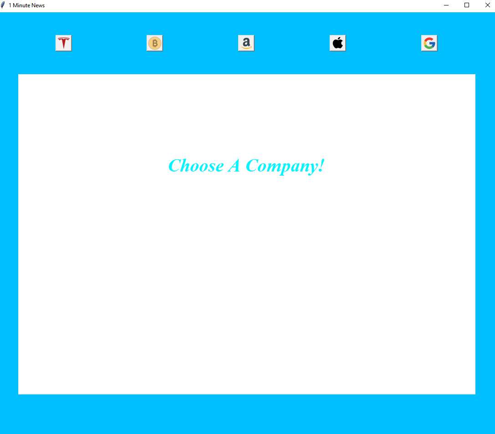
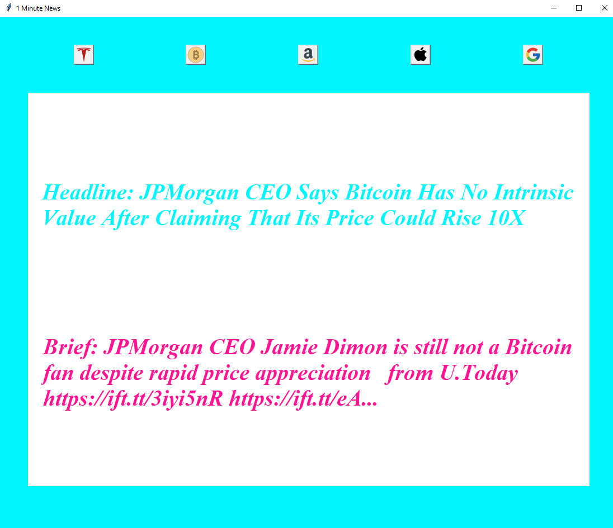

# 1-Minute-News
A program that gives you the headlines of top companies. They are Tesla, Bitcoin, Amazon, Apple and Google. It is built with tkinter and NewsAPI.
# Installation
```
$ pip install -r requirements.txt
```
# Usage
- Click on a company's logo.
- That's it. You will see the latest headline of that company.
# Preview


